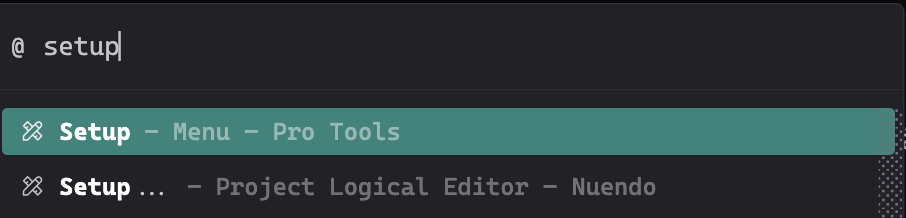
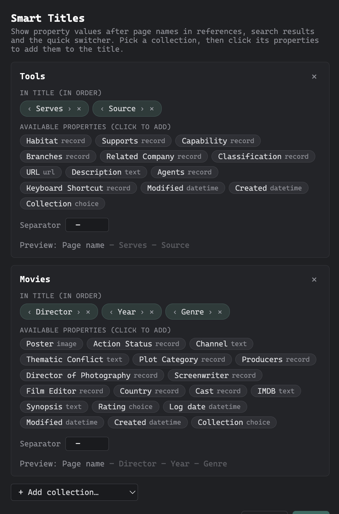

# Smart Titles

Smart Titles is a [Thymer](https://thymer.com) plugin that shows a page's properties next to its name. Wherever a page appears as a reference, in search results, or in the quick switcher, its title is extended with the property values you've chosen, shown in gray after the name. That way you can tell similar pages apart and understand what a page is about without opening it. The extra information only appears where it helps: references inside a sentence, collection views, and the open page's own title stay plain. You decide which collections and properties to show, in what order and with what separator, through a simple settings dialog in the command palette. Everything is display only, so your actual page titles are never changed.



## Where it shows

| Context | Decorated? |
|---|---|
| References that stand alone on a line | Yes |
| Page headings in search results | Yes |
| Jump To / quick switcher and other record autocompletes | Yes |
| References inside a sentence (text before/after) | No |
| Collection views (Table, Board, Gallery, Calendar) | No |
| The open page's own title | No (you're already on the page; avoids truncation) |
| Page-properties editor, panel tabs | No |

Supported property types: linked pages (record), choice, text, number, date/datetime, and people. A field like "Year" may itself be a record link (to a Years collection); that's handled, and its linked page name is shown. Multi-value properties are joined with commas, empty properties are skipped, and suffixes update live when property values change.

## Installation

1. In Thymer, open the Command Palette (`Cmd+P` / `Ctrl+P`), run **Plugins**, and click **Create Plugin** under Global Plugins.
2. In the plugin's dialog, go to the code editor (click **Edit as Code** if you see the settings view).
3. In the **Custom Code** tab, replace the contents with [`dist/plugin.js`](dist/plugin.js).
4. In the **Configuration** tab, replace the contents with [`plugin.json`](plugin.json).
5. Click **Save**.

Don't enable Hot Reload (it's a development feature; see the dev caveat below).

## How to use



1. Open the Command Palette and run **Smart Titles Settings**.
2. Pick a collection from the **Add collection** dropdown (it lists every collection that has usable properties).
3. The collection's available properties are listed with their types. Click one to add it to the title.
4. Reorder with the `‹` `›` arrows, remove with `✕`.
5. Set the separator text for that collection. The live preview shows the result.
6. Click **Save**. Changes persist immediately and apply without a restart.

Come back to the same dialog any time to change properties, reorder them, adjust separators, or remove a collection with the `✕` on its card. After install, configuration is done entirely through this dialog — no code editing needed.

### Advanced: JSON configuration

The dialog writes to the plugin's configuration under `custom.collections`. If you prefer, you can edit it directly via Plugins → Edit Code → Configuration:

```json
"custom": {
  "collections": {
    "<Collection name>": { "fields": ["<Field label>", "..."], "separator": " – " }
  }
}
```

## Troubleshooting

**A linked-page property shows nothing, but the record looks filled in.** The stored link is probably *dangling*: it points to a page that was deleted (common after an import/migration, where many records linked to a since-deleted target). Thymer's property panel still shows the old name from an internal cache, but the link can't actually be resolved, so Smart Titles shows nothing rather than a raw ID. Re-picking the value on the record repairs the link and it shows normally.

**Decorations disappeared after a Thymer update.** The plugin reads Thymer's interface to place its labels, so an app update can rename the hooks it relies on. Nothing breaks and no data is at risk; the plugin just goes quiet until its selectors are updated. Open an issue if this happens.

## How it works

Smart Titles never writes to your data. It watches the interface and appends a styled label after page names in the contexts listed above; removing the plugin restores Thymer exactly as it was.

Because there is no official Thymer API for some of this, it relies on a few internals, each wrapped so failures degrade to "no decoration":

- DOM class names (verified against the desktop app, June 2026): `span.lineitem-ref[data-guid]`, `.line-div`, `.lineitem-text`, `.listitem-search-heading`, `.autocomplete--option-label`, `.table-view`, etc.
- `record._getRow().pguid` to resolve a record's collection (no public accessor in the SDK).
- Autocomplete options carry no record guid in the DOM, so the guid is read from the focused component tree: `results[i].obj.json.guid` aligned with `cachedResultDomNodes[i]`, found by walking `window.g_focusedComponent` and its `.children`.

Settings are saved with the plugin-management API `saveConfiguration(conf)` (via `data.getAllGlobalPlugins()`, matching on the plugin's own guid), then re-applied in memory so changes show without a restart. The settings dialog itself is plain DOM injected into `document.body` with its own CSS, not a Thymer dialog API.

## Development

```
smart-titles/
├─ plugin.js        # readable source (export class Plugin extends AppPlugin)
├─ plugin.json      # plugin configuration
├─ dist/plugin.js   # built bundle, what you paste into Thymer
└─ tools/           # dev helpers (Chrome DevTools Protocol against the desktop app)
   ├─ cdp.js        # evaluate JS in Thymer's window (needs --remote-debugging-port=9222)
   └─ push.js       # hot-push code+config to a plugin with Hot Reload enabled
```

The dev loop follows the [Thymer plugin SDK](https://github.com/thymerapp/thymer-plugin-sdk): run Thymer (or Chrome) with `--remote-debugging-port=9222`, enable Hot Reload on a scratch plugin, and push with `node tools/push.js`.

> **Dev caveat:** while Hot Reload is enabled, Thymer caches the last hot-pushed configuration and restores it on every reload. This silently overrides settings saved at runtime and survives app restarts. If config saves stop sticking during development, the plugin's preview state is contaminated; delete and recreate the plugin without Hot Reload. End users who never enable Hot Reload are unaffected.

## License

[MIT](LICENSE)
